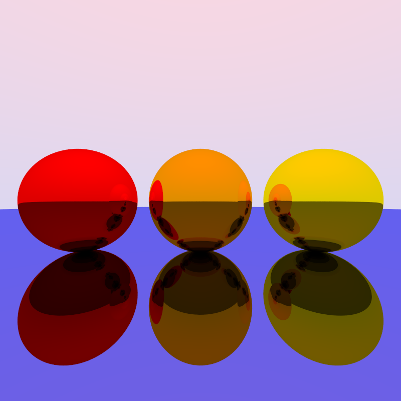
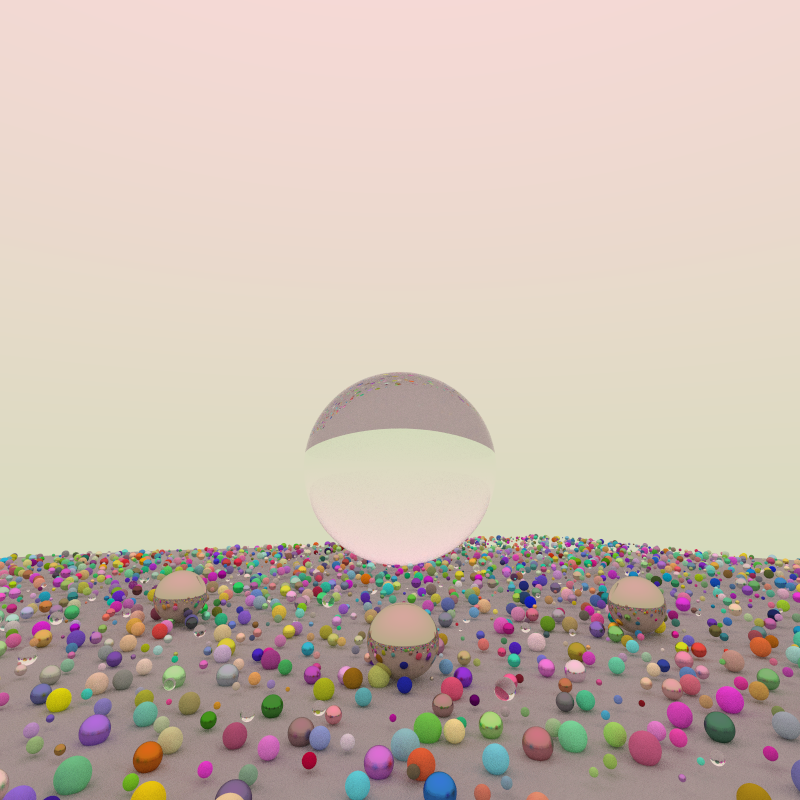

# go-pathtracer

A Golang pathtracer made using the book *Raytracing In One Weekend* by *Peter Shirley* available [here](raytracing.github.io). Some references were made to [this](https://github.com/markphelps/go-trace) project as well for asynchronous optimisations and increase modularity of code.

## Example Program
Basic usage of the package is illustrated below:
```go
import (
    pt "github.com/nadav-rahimi/pathtracer"
    "image/png"
    "os"
)

var nx int = 800
var ny int = 800
var ns int = 100

w := pt.NewWorld()
w.Add(pt.NewSphere(pt.Vec3{0, 0, -1}, 0.5, pt.Metal{pt.Orange, 0}))
w.Add(pt.NewSphere(pt.Vec3{-1, 0, -1}, 0.5, pt.Metal{pt.Red, 0}))
w.Add(pt.NewSphere(pt.Vec3{1, 0, -1}, 0.5, pt.Metal{pt.Yellow, 0}))
w.Add(pt.NewSphere(pt.Vec3{0, -1000, 0}, 999.5, pt.Metal{pt.SortaBlue, 0}))

cam := pt.NewCamera(pt.Vec3{0, 0, 1}, pt.Vec3{0,0,-1}, 90, (float64(nx)/float64(ny)))
img := pt.Render(nx, ny, ns, cam, w, pt.Blue, pt.LightPink)

f, _ := os.Create("example.png")
png.Encode(f, img)
```

## Image Examples





## TODO
- [ ] Robust image saving
- [ ] Add more examples
